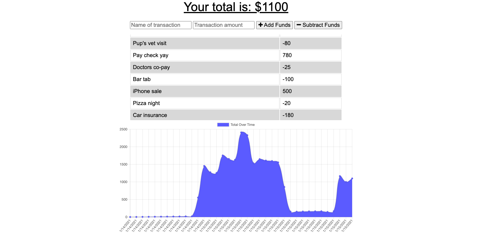

# budget-tracker

https://agile-sea-54111.herokuapp.com/

## Description
 This app is a budget tracker! The user will be able to add expenses and deposits to their budget with or without a connection. When entering transactions offline, they should populate the total when brought back online.
## Table of Contents
- [Description](#description)
- [Installation](#installation)
- [Usage](#usage)
- [License](#license)
- [Contributing](#contributing)
- [Tests](#tests)
- [Questions](#questions)
## Installation
npm packages and dependencies including compression, express, lite-server, mongoose, and morgan
## Usage
Giving users a fast and easy way to track their money is important, but allowing them to access that information anytime is even more important. Having offline functionality is paramount to our applications success. 

## License
MIT
## Contributing
[Alexandra Hionis](https://github.com/Alexandra-Hionis/README-Generator)
## Tests
No tests were used
## Questions
GitHub: https://github.com/Alexandra-Hionis  
Email: Alexandra.hionis@gmail.com  
